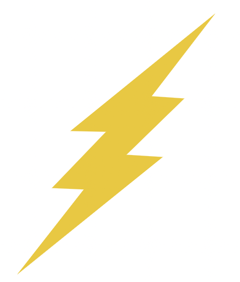

    

        

            Go back to homepage
        

    

    

        

            
name

            
Player Level

        

        

            <!-- 
Damage
 -->
            
Health

        

    

    

        
Enemy: 

        
Enemy Health: 

    

    

        

            
        

        

            
        

    

    

        <h1>Attack</h1>
        
Select an Attack

        

            <!-- Dynamically filled answers will go here! -->
        

        

            <h1 id="hint-text"></h1>
        

    

    

        

            <h1>Attack</h1>
        

        

            <h1>Potions</h1>
        

        

            <h1>Inventory</h1>
        

        

            <h1>Run Away</h1>
        

    

    

         
        

            <h1 class="centered">Player Stats</h1>

            <h1 id="characterHealth"></h1>
            <h1 id="characterDamage"></h1>
             
            <h1>Equipped Gear</h1>
            

            

        

        

        

            <h1>Armor</h1>
        

         
        

            <h1>Weapons</h1>
        

         
        <!-- 
        

            <h1>Accessories</h1>
        
 -->
        
Drop Here to Equip

    

    

    

        <h1>Keys:</h1>
        <h1 id="key_num" class="hidden"></h1>
        

    

    <button class="key-btn" onclick="useKey()"> Use Key</button>

    

        <button class="close-btn" onclick="closeKeyPopup()">X</button>
        <h2>Power-up Options</h2>
        
Earn keys by playing cyber games in the cyber house!

        
Use a key for one of the following power-ups:

        

            

                    <button onclick="useHint()">Hint</button>
                    
                

                

                    <button onclick="useSkip()">Skip</button>
                    
                

                

                    <button onclick="useDmg()">+10 Damage</button>
                    
                

        

    

